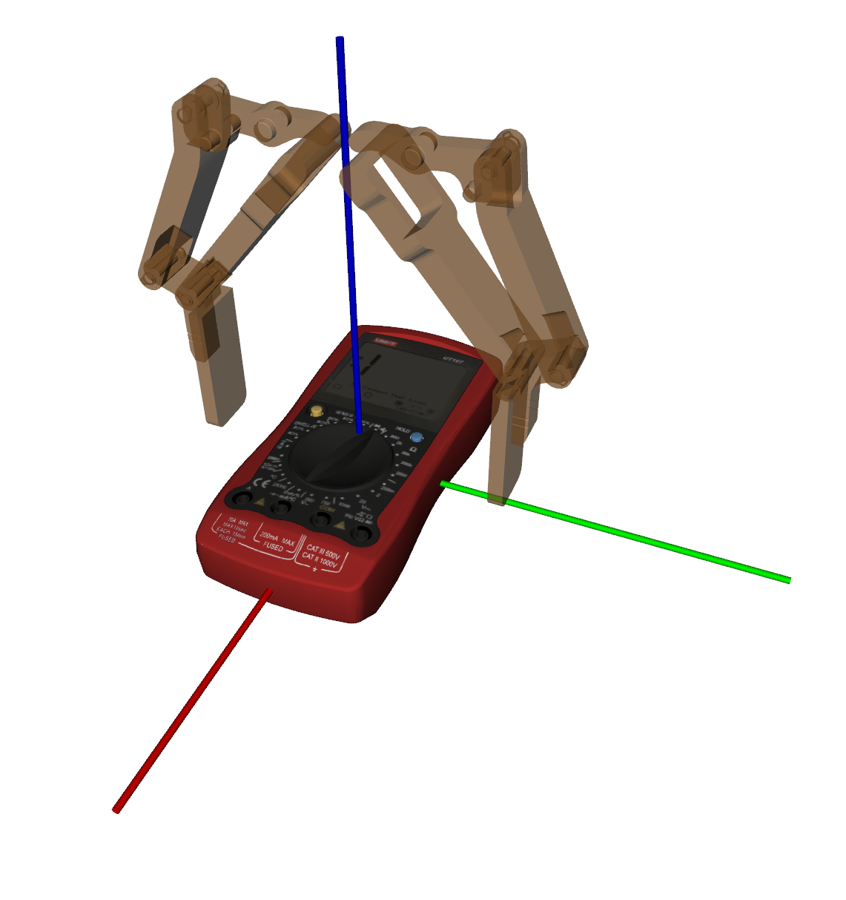
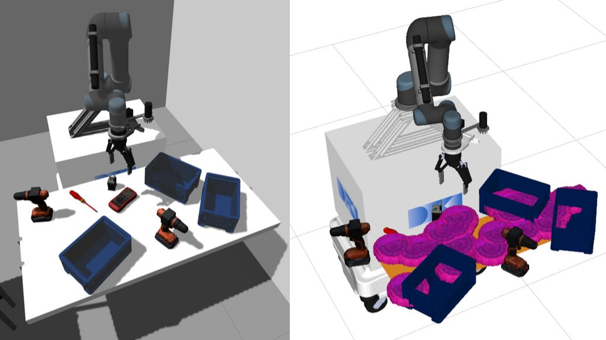

.. _functionality:

Functionality
=============

Grasplan offers a wrapper around the MoveIt pick n place pipeline to use the grasps generated during grasp planning.

To learn more about the MoveIt pick n place pipeline, please refer to the
`MoveIt pick n place pipeline documentation <https://ros-planning.github.io/moveit_tutorials/doc/pick_place/pick_place_tutorial.html>`_.

Picking an object
-----------------

`Grasplan Parameters <https://github.com/DFKI-NI/mobipick/tree/noetic/mobipick_pick_n_place/config/grasplan>`_
were carefully configured for the Mobipick robot to grasp objects.

    Pre-recorded grasp pose for multimeter.

Placing an object
-----------------

Grasplan provides with sampling of free space poses for placing an object. The poses are sampled using a random uniform distribution
in the x, y axis. The orientation is sampled only to vary the yaw. The current approach is to iterate over the sampled poses and
execute the first one with a valid plan. Grasplan will generate few samples in the first try and then increase the number of samples
in the next try if the previous try failed.

    Placing an object in a cluttered table.
