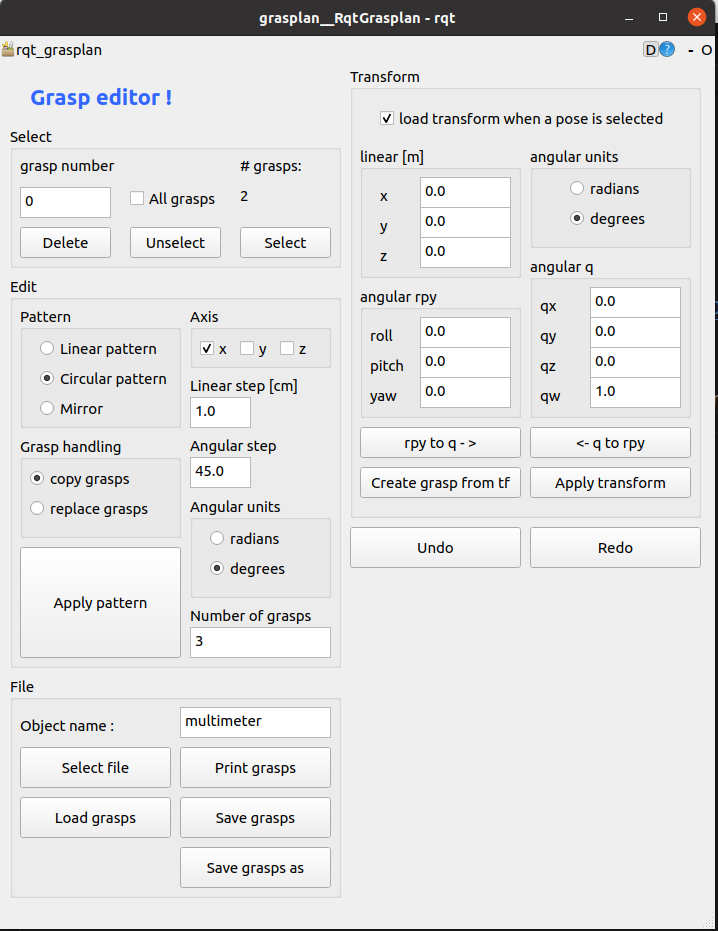

.. _grasp_editor:

Grasp editor
============

A GUI interface is provided to edit grasps. The grasp editor can be launched by running the following command:

``roslaunch grasplan grasp_editor.launch object_name:=<object_name>``

where object_name is one of: ``materialbox``, ``relay``, ``hot_glue_gun``, ``multimeter``, ``screwdriver``, ``klt``, ``power_drill_with_grip``

for an up to date list of objects see
`mobipick_pick_n_place/config/grasplan/object_grasps <https://github.com/DFKI-NI/mobipick/tree/noetic/mobipick_pick_n_place/config/grasplan/object_grasps>`_.

The following `video  of the grasp editor <https://youtu.be/OYuSxzf0pA4>`_ demonstrates the process.

Functionality includes:

- selecting grasps by: number or all grasps, (when selected, grasps change their color on rviz from brown to green)
- transform grasps
- create linear or circular patterns, mirror grasps
- undo/redo, save, load grasps

   Grasp editor GUI.
