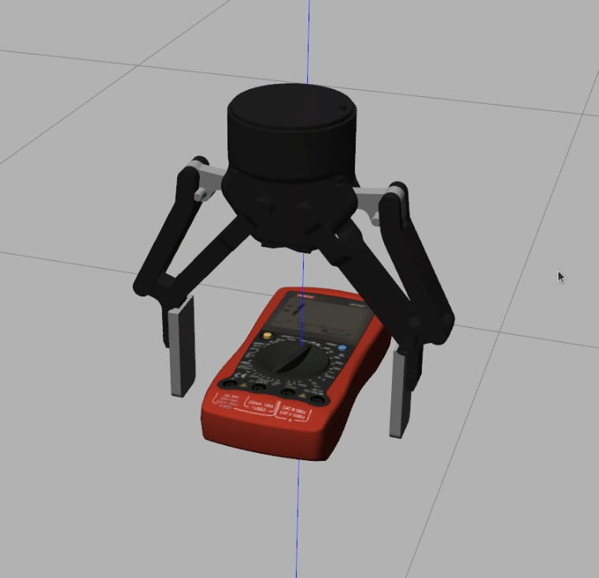

Recording Grasps
=================

Offline recorded grasps are encoded as a list of 6D poses (translation + rotation in quaternion format) in the reference frame of the object, e.g.:

.. note::

    For now, the following branch is required to record grasps in gazebo simulation:
    https://github.com/DFKI-NI/mobipick/tree/grasplan-teach-poses

.. code-block:: yaml

    multimeter:
      grasp_poses:
        -
        translation: [0.000000, 0.000000, 0.020000]
        rotation: [0.707100, 0.000000, -0.707100, 0.000000]
        -
        translation: [0.000000, 0.000000, 0.020000]
        rotation: [0.000000, 0.707100, -0.000000, 0.707100]

To record grasps using gazebo simulation a launch file is provided. Run it as follows:

``roslaunch grasplan teach_grasp_poses_gazebo.launch``

The approach consists of spawning only the robotic hand in simulation and the object to be teached how to grasp.
The object is placed in the center of the world without gravity, where the gripper can freely float.
The gripper is then controlled in velocity mode by using the `gazebo_ros_vel plugin <https://github.com/aprilprojecteu/april_gazebo_plugins>`_.

The user moves the gripper in 6D space and hits ``enter`` to record a grasp. At the end press ``q`` to quit and save the grasps to a yaml file.

The following `video <https://youtu.be/osATE2MKjYU>`_ demonstrates the process.

    Teaching grasp poses in gazebo simulation.
