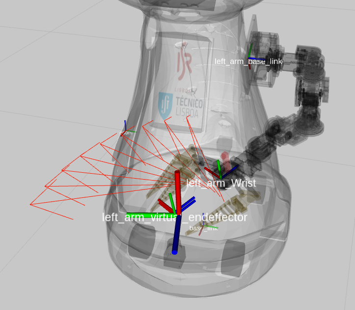
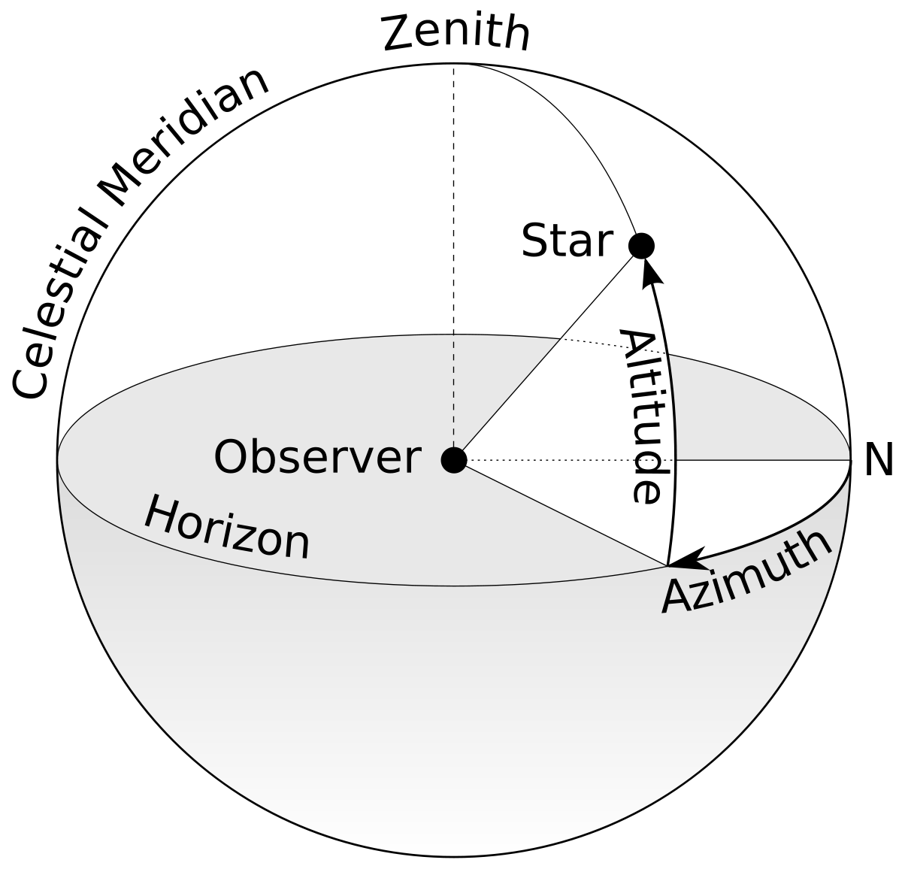
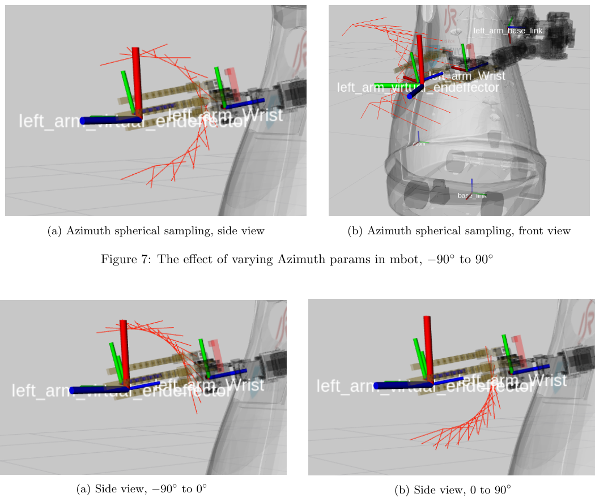
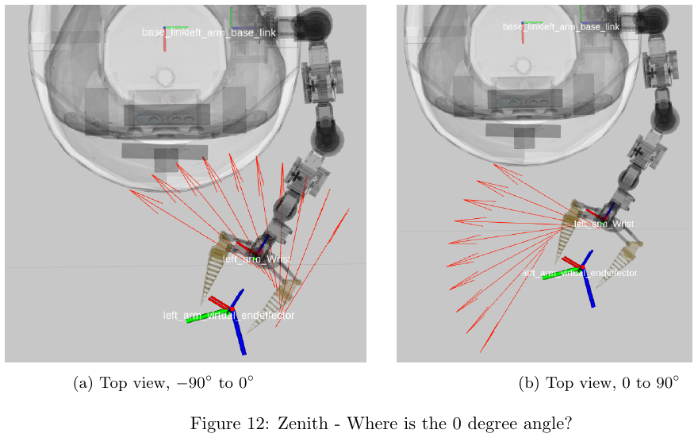
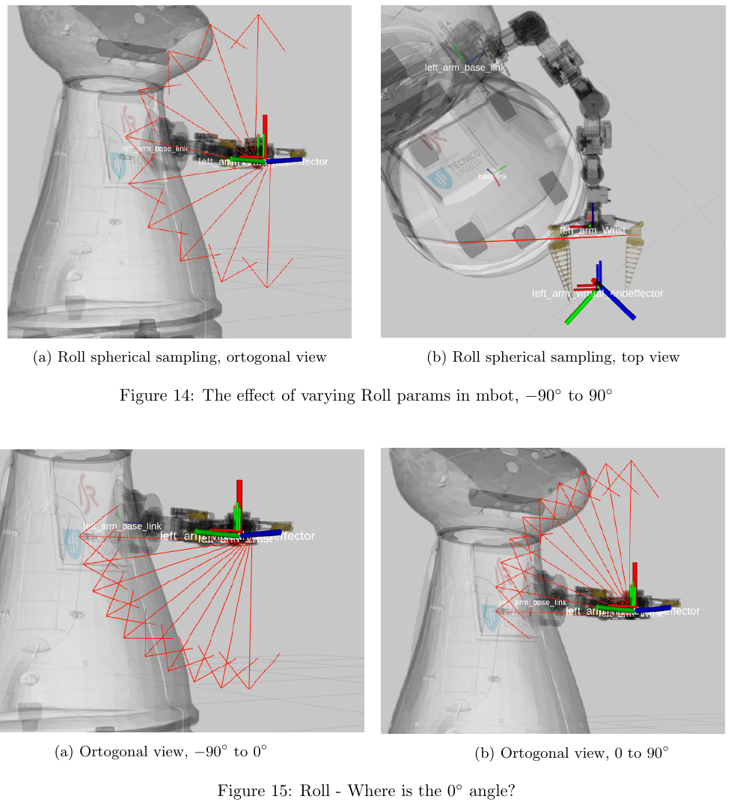

.. _simple-pregrasp-planner:

Simple Pregrasp Planner
=======================

Introduction
------------

Given a 6D pose of an object, this planner computes multiple grasp poses for a robot end-effector around an example pose.
By varing the angular parameters azimuth, zenith and roll, the planner is able to find a kinematic solution most of the times.

   `Monarch robot (mbot) <https://www.idmind.pt/solutions/socialrobots/>`_ rviz visualization of the simple pregrasp planner.

The following video shows the planner in action: `rviz pregrasp planner visualization <https://youtu.be/P3BOUpIzOS8?si=MT2qAibn_mYGRhGW>`_

This planner works best for cylindrical objects, e.g. pringles.

.. note::

    This planner has not been used in a long time and therefore it's stability might be questionable.

Credits
-------

The grasplan simple pregrasp planner code is an adaptation made by Oscar Lima, oscar.lima@dfki.de of the
`mir_pregrasp_planner <https://github.com/b-it-bots/robocup-at-work/tree/leipzig-2016/mas_industrial_robotics/mir_manipulation/mir_pregrasp_planning>`_
developed by `Dr. Jose Sanchez <https://github.com/jsanch2s>`_ in 2016.

Original author documentation can be found `here <https://github.com/b-it-bots/robocup-at-work/blob/leipzig-2016/mas_industrial_robotics/mir_manipulation/mir_pregrasp_planning/README.md>`_.

Overview of usage steps
-----------------------

- Record an example arm pose - This can be done by teleoperating the robot arm and manually going to an "example object pose"
  which is recommended to be in the center of the workspace. One could think of this step as a kind of training to the robot about how to reach an object
  on ideal conditions. However, in fact the Simple Pregrasp Planner does not use any machine learning but instead spherical sampling, and finding brute force closed form solutions.
- Get object pose from perception, assuming the object is graspable from the center regardless of its yaw (theta) orientation which is reasonable for cylindrical objects.
- Preserve object position but replace orientation with the previously recorded "example orientation".
- Sample various arm poses in spherical coordinates around the modified object pose to accommodate for small variations due to the
  offset between the example pose and the new object pose (which in general is always different). This variation is mainly in zenith for horizontal plane variations
  (same z but different obj x, y, theta) and azimuth for variations in obj height.
- Iterate over each pose until IK is found (first one to be found is returned but sampling is done inside out, starting with the sample at the center of the pose array)
- If success (IK was found), return arm joint angles that are able to place the manipulator endeffector around the object.

    Azimuth and zenith spherical sampling parameters (Altitude = roll)

Parameter tunning
-----------------

The following images aim to assist in tunning the basic planner parameters.

Azimuth
~~~~~~~

Used to adjust gripper pitch, it accommodates for changes in object height.

    Azimuth parameters visualization for mbot robot.

Zenith
~~~~~~

Used to adjust gripper yaw.

    Zenith parameters visualization for mbot robot.

Roll
~~~~

Used to adjust gripper roll.

    Roll parameters visualization for mbot robot.
