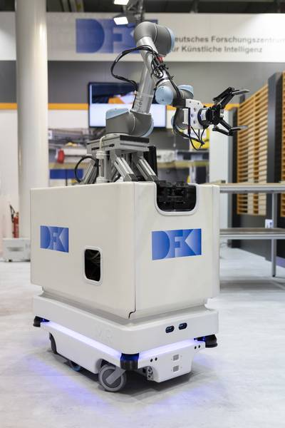

Installation
============

``System requirements: Ubuntu 20.04, ROS1 noetic``

Unless you want to use a specific tool provided by Grasplan, the recommended way to install is via Mobipick labs repository at:

https://github.com/DFKI-NI/mobipick_labs

Note that this will install a lot of things, related to the Mobipick robot.

Since at the moment Grasplan is loosely coupled to the Mobipick robot, it makes sense that you install the Mobipick software stack.

   `Mobipick robot <https://robotik.dfki-bremen.de/en/research/robot-systems/mobipick>`_
   by DFKI: `MiR base <https://www.mobile-industrial-robots.com/solutions/robots/mir100/>`_ + 
   `UR5 arm <https://www.universal-robots.com/de/produkte/ur5-roboter/>`_ +
   `Robotiq gripper <https://robotiq.com/products/2f85-140-adaptive-robot-gripper>`_.

Alternatively you can clone Grasplan from source in a ROS1 noetic catkin workspace. In this scenario you want to integrate Grasplan
with your own robot, which requires a high degree of expertise in ROS1 and MoveIt and Grasplan itself, something that we actually would
like to do in the future.

Additional dependencies
-----------------------

For teaching grasps with gazebo, you need to install the following additional dependencies:

https://github.com/aprilprojecteu/april_gazebo_plugins

and ideally own a 3D mouse, like the SpaceMouse from 3Dconnexion. This is not mandatory, but it makes the teaching process much more easy.
Alternatively you can use the keyboard to teach grasps.

In case you have a 3D mouse, you need to install the following additional dependencies:

``sudo apt install ros-noetic-spacenav-node``
