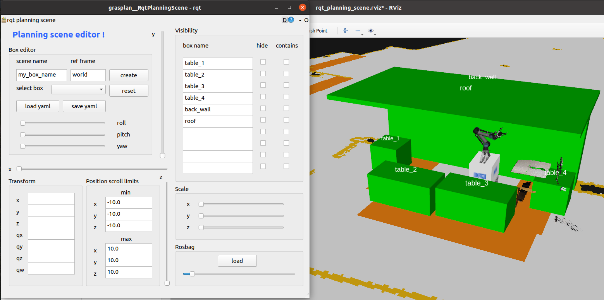

Planning scene GUI
===================

A rqt GUI is provided to construct a "grasplan" planning scene as a set of boxes.

The format in which the boxes are saved is a yaml file with the following structure:

.. code-block:: yaml

    planning_scene_boxes:
    - scene_name: 'table_1'
      frame_id: 'map'
      box_x_dimension: 0.8
      box_y_dimension: 1.4
      box_z_dimension: 1.02
      box_position_x: 0.0
      box_position_y: 1.2
      box_position_z: 0.51
      box_orientation_x: 0.0
      box_orientation_y: 0.0
      box_orientation_z: 0.0
      box_orientation_w: 1.0
    - scene_name: 'table_2'
      frame_id: 'map'
      box_x_dimension: 0.7
      box_y_dimension: 3.3
      box_z_dimension: 0.9
      box_position_x: 0.8
      box_position_y: 1.61
      box_position_z: 0.5
      box_orientation_x: 0.0
      box_orientation_y: 0.0
      box_orientation_z: 0.0
      box_orientation_w: 1.0

Before picking/placing/inserting, grasplan iterates over the boxes inside the yaml file and adds them to the planning scene using MoveIt.

An rqt GUI is therefore provided to assist in building the planning scene, to launch it run the following command:

.. code-block:: bash

    roslaunch grasplan find_planning_scene_boxes_helper.launch bag_path:=/path/to/bag world_config:=cic_tables

Where ``bag_path`` is the path to a rosbag file containing the following topics:

.. code-block:: bash

    /map
    /tf
    /tf_static
    /mobipick/eef_main_cam/* # all topics under this namespace, in particular the point cloud topics

and ``world_config`` is a string variable to determine where the yaml file will be saved:

``<tables_demo_bringup pkg path>/config/<world_config>_planning_scene.yaml``

Upon launching the command a window will appear that looks like this:

   rqt gui used to construct/edit a planning scene.

At first the map will not be visible, the reason for this, is that: it has not yet being published.

To publish the map topic for the first time, affect the scrollbar inside the Rosbag frame and move it to any position,
the gui will play the bag for a small amount of time making the map topic available.

Next click on `select box` combo box and choose a box, then use the ``x``, ``y``, ``z`` scrollbars to move it around the map.

Most probably you will need to adjust the position scoll limits, simply write the desired value under ``min x``, ``max x``, ``min y``, ``max y``, ``min z``, ``max z``.

The rest of the buttons are self explanatory, feel free to play around with them.

NOTE: The following widgets are not implemented:

- all widgets under `Transform` frame are not yet implemented
- all `contains` checkboxes are not implemented.
- scaling the boxes is not yet implemented.
